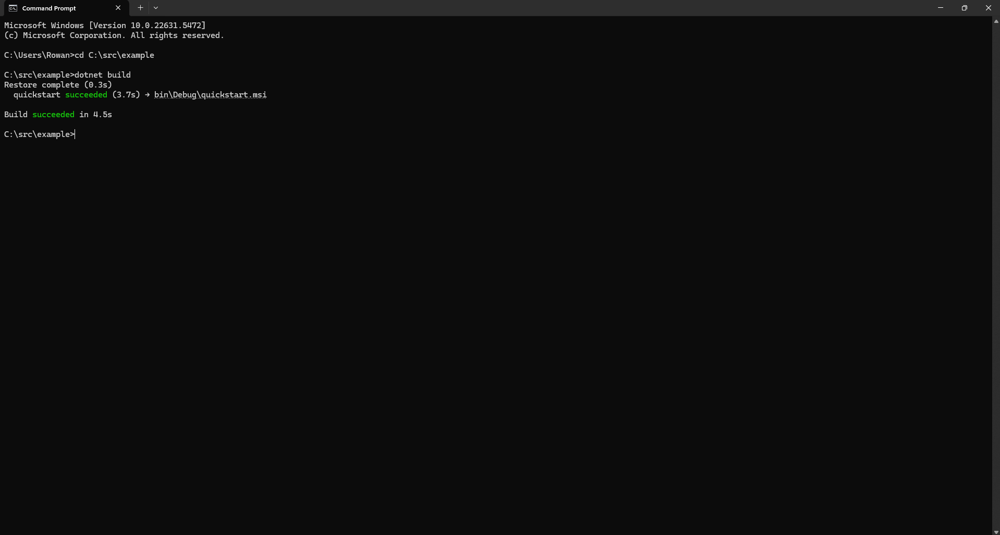

# MSI-maker
**Simple readme for making msi files
first of all you need to go to
https://docs.firegiant.com/quick-start/ # for learning about this
https://dotnet.microsoft.com/en-us/download/dotnet/thank-you/sdk-9.0.303-windows-x86-installer #32-bit installer if your pc is 32 bit
https://dotnet.microsoft.com/en-us/download/dotnet/thank-you/sdk-9.0.303-windows-x64-installer #64-bit installer if your pc is 64 bit
https://dotnet.microsoft.com/en-us/download/dotnet/thank-you/sdk-9.0.303-windows-arm64-installer #Arm-64 installer if pc is arm 64
https://guidgenerator.com/ #for replacing REPLACE-GUID-HERE**
=======================================================================================================================================================================================================Ok so first download the files which are in main.zip or example.txt product.wxs package.wxs and quickstart.wixproj
after that **DO NOT OPEN THEM** goto cmd.exe or command prompt then type md c:\src\<your folder name> #<- replace with actual folder name of what you want
then type in cd c:\src\<your folder name> #<- replace with actual folder name of using md
then with all the files adjusted and made to your preferences in the same cmd window type in dotnet build
you should see a loading screen then if it works it should say its completed like this

